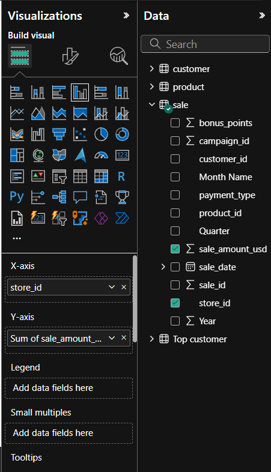
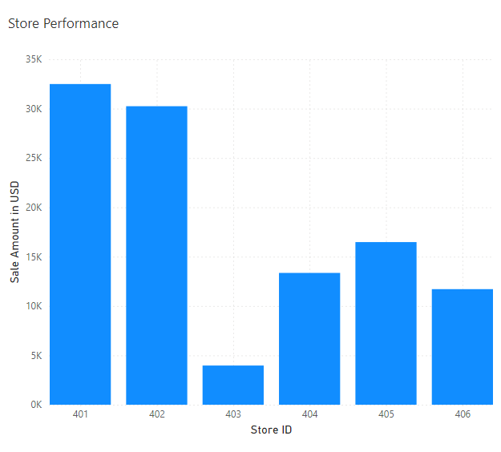

# smart-store-mchastain: BI Python Project

This document outlines the setup and development process for the Smart Sales project, a Business Intelligence (BI) Python project.

## Smart Sales Project Setup

These starter files provide the foundation for your Smart Sales project. To get started, follow these steps on a Windows machine, executing all commands from a VS Code terminal within the main project directory.

**Project Initialization:**

1.  **Create a GitHub Repository:**
    * Create a new repository on GitHub to manage your project's version control.

2.  **Clone the Repository:**
    * Clone the repository to a folder on your C-drive using the following command (replace `<your_github_repo_url>` with your actual repository URL):

        ```bash
        git clone <your_github_repo_url>
        ```

3.  **Create a Virtual Environment:**
    * To isolate your project's dependencies, create a virtual environment named `.venv` by running:

        ```bash
    py -m venv .venv
        ```

4.  **Activate the Virtual Environment:**
    * Activate the virtual environment to use its isolated packages:

        ```bash
        .venv\Scripts\activate
        ```

5.  **Install Required Packages:**
    * Install all necessary libraries listed in the `requirements.txt` file:

        ```bash
        py -m pip install --upgrade -r requirements.txt
        ```

6.  **Optional: Verify Environment Setup:**
    * You can verify that your virtual environment is set up correctly by running:

        ```bash
        py -m datafun_venv_checker.venv_checker
        ```

7.  **Run the Data Preparation Script:**
    * Execute the initial data preparation script to prepare your data:

        ```bash
        py scripts/data_prep.py
        ```

## Initial Software Libraries

The project relies on the following Python packages:

* `pip`: The package installer for Python.
* `loguru`: For enhanced logging.
* `ipykernel`: Enables Python kernels for Jupyter.
* `jupyterlab`: The JupyterLab interactive development environment.
* `numpy`: For numerical computing.
* `pandas`: For data manipulation and analysis.
* `matplotlib`: For basic plotting.
* `seaborn`: For statistical data visualization.
* `plotly`: For interactive visualizations.
* `pyspark==4.0.0.dev1`: Apache Spark for large-scale data processing (development version).
* `pyspark[sql]`: Spark SQL module.

## Folder Structure Setup

1.  **Add Folders:**
    * Add the following folders to the root project folder:
        * `Data`
        * `Scripts`
        * `utils`

2.  **Data Folder Setup:**
    * Inside the `Data` folder, create a folder named `Raw`.
    * Inside the `Raw` folder, add the following files:
        * `sales_data`
        * `customer_data`
        * `product_data`
    * Add the appropriate raw data to each file.

3.  **Utils Folder Setup:**
    * In the `utils` folder, add a file named `logger.py`.

4.  **Scripts Folder Setup:**
    * In the `Scripts` folder, add a file named `data_prep.py`.

## Version Control

* Continuously use `git commit` to save and log all changes and events. This ensures that your project's history is well-documented and that you can easily revert to previous versions if needed.

## Data Cleaning Process

This section details the data cleaning process using Python's `pandas` library.

### Data Cleaning Scripts

Run scripts to clean your data and perform the following operations:

* Remove Duplicates: Eliminate any duplicate entries within the dataset.
* Handle Missing Values: Address missing data points through imputation or removal.
* Remove Outliers: Identify and adjust outlier data points.
* Ensure Consistent Formatting: Standardize data formats for uniformity.

To execute a Python script (e.g., `file.py`) within the `scripts` folder, use:

```bash
py scripts\file.py


####Creating a Data Warehouse (SQLite)
This section describes how to create a SQLite database to serve as a simple data warehouse using a Python script.

Steps
Create create_dw.py:

Create a file named create_dw.py inside the scripts folder of your project.
Add Python Code:

Add the following Python code to create_dw.py. This script uses the sqlite3 library to create tables within an SQLite database.
import sqlite3

def create_tables(db_path):
    """Creates tables in the SQLite database."""

    try:
        conn = sqlite3.connect(db_path)
        cursor = conn.cursor()

        # Example: Create a 'sales' table
        cursor.execute('''
            CREATE TABLE IF NOT EXISTS sales (
                sale_id INTEGER PRIMARY KEY,
                product_id INTEGER,
                customer_id INTEGER,
                sale_date TEXT,
                quantity INTEGER,
                price REAL
            )
        ''')

        # Example: Create a 'products' table
        cursor.execute('''
            CREATE TABLE IF NOT EXISTS products (
                product_id INTEGER PRIMARY KEY,
                product_name TEXT,
                category TEXT
            )
        ''')

        #Example: Create a customers table
        cursor.execute('''
            CREATE TABLE IF NOT EXISTS customers (
                customer_id INTEGER PRIMARY KEY,
                customer_name TEXT,
                city TEXT
            )
        ''')

        conn.commit()
        print(f"Tables created successfully in {db_path}")

    except sqlite3.Error as e:
        print(f"An error occurred: {e}")

    finally:
        if conn:
            conn.close()

if __name__ == "__main__":
    db_path = "smart_store_dw.db"  # Database file name
    create_tables(db_path)

    This will create a file named smart_store_dw.db.

Important: The database script must be in perfect alignment with your data or you will encounter errors.

Populating Star Schema Tables with SQL
This section outlines the steps to create and run an SQL script that populates tables in a star schema within your SQLite data warehouse. We will assume you have a smart_store_dw.db database created (as per previous instructions) and that you have "prepared" data available (though the exact format and location are placeholders here - you'll need to adjust based on your actual prepared data).

####Create the SQL Script (populate_dw.sql in scripts folder):

Create a new file named populate_dw.sql inside your scripts folder. This script will contain the INSERT INTO statements to populate your fact and dimension tables.

SQL

-- scripts/populate_dw.sql

-- Populate the DimCustomers table
INSERT INTO DimCustomers (CustomerID, CustomerName, City)
SELECT DISTINCT
    customer_id,
    customer_name,
    city
FROM prepared_customers_data; -- Replace with your actual prepared data source/table

-- Populate the DimProducts table
INSERT INTO DimProducts (ProductID, ProductName, Category)
SELECT DISTINCT
    product_id,
    product_name,
    category
FROM prepared_products_data; -- Replace with your actual prepared data source/table

-- Populate the FactSales table
INSERT INTO FactSales (Sale, Product, Customer)
SELECT
    s.sale_id AS Sale,
    p.product_id AS Product,
    c.customer_id AS Customer
FROM prepared_sales_data s -- Replace with your actual prepared sales data source/table
JOIN prepared_products_data p ON s.product_id = p.product_id -- Assuming a join is needed
JOIN prepared_customers_data c ON s.customer_id = c.customer_id; -- Assuming a join is needed

-- You might need to adjust the joins and column names based on your prepared data structure.
-- Ensure the column names in these SELECT statements EXACTLY match the column names
-- in your prepared data sources.
-- Also, ensure the target table column names in the INSERT INTO statements
-- EXACTLY match the column names defined in your data warehouse schema
-- (e.g., in your create_dw.py script).
Initial set up of PowerBI and SQLite
Open ODBC Data Sources (64-bit) from the Start Menu.
Click the System DSN tab.
Click Add... → choose SQLite3 ODBC Driver (or whatever data store you are using) → click Finish.
Name it SmartSalesDSN (or any name you prefer).
Click Browse and select your database file: e.g., smart_sales.db (or whatever you named it).
Click OK to save.
Linking Data Warehouse to PowerBI
Open Power BI Desktop.
Click Get Data (top left) → Select ODBC from the list.
Choose the DSN you created in Task 1 (e.g., SmartSalesDSN).
Click OK. Wait a moment. Power BI will show a list of available tables.
Select the tables you want to analyze - for most of us:
Customer table
Product table
Sales table
Click Load to bring the tables into Power BI.
Switch to Model view (left panel) to see how the tables are connected.
Performing a Query
Open Power BI Desktop.

In the Home tab, click Transform Data to open Power Query Editor.

In Power Query, click Advanced Editor (top menu).

(Using SQL - Requires Data Source Connection):
Delete any code in the editor and replace it with your SQL query (example below). You must have already established a connection to your data source (e.g., via ODBC) for this to work. You will need to use your actual table names and column names for the SQL to function correctly with your data source.

SQL

SELECT c.name, SUM(s.amount) AS total_spent
FROM sale s
JOIN customer c ON s.customer_id = c.customer_id
GROUP BY c.name
ORDER BY total_spent DESC;
Click Done.

Rename the new query (on the left) to something like Top Customers or whatever you are focusing on.

Click Close & Apply (upper left) to return to the report view.

You can now use this table in visuals (e.g., bar chart).

######Slice, Dice, and Drilldown 
We will implement slicing, dicing, and drilldown techniques to analyze sales.

Windows (Power BI) - Slice, Dice, and Drilldown

Slicing: Add a date range slicer
Dicing: Create a matrix visual for sales by product & region
Drilldown: Enable drill-through to explore sales by year → quarter → month

*Slicing in Power BI (by Date)
Since SQLite doesn’t have real "Date" fields, use Power BI's Transform Data to extract parts of the date for slicing, dicing, and drilldown.

Click Transform Data to open Power Query.
Select the sales table.
Select the order_date column (or any "date" field).
On the top menu, click Add Column → Date → Year.
Then click Add Column → Date → Quarter.
Then click Add Column → Date → Month → Name of Month.
Click Close & Apply to save changes and return to the report view.
In Power BI, go to the Report view (center icon on the left).
From the Visualizations pane, click on the Slicer icon.
Drag a date field into the slicer.
If it doesn’t show a range, click the dropdown (upper-right corner of slicer) and select Between to enable a date range slider.

*Dicing in Power BI (by Product Attributes)
To explore sales by product attributes (e.g. category and region or other characteristics), we’ll create a Matrix visual in Power BI.
Go to the Report view.
From the Visualizations pane, click the Matrix visual.
Drag your first product feature (e.g., category) to the Rows field well.
Drag your second product feature (e.g., region) to the Columns field well.
Drag a numeric field to the Values field well.
Optional: Format the numeric values by clicking the column dropdown in the Values area.
This matrix will help us “dice” the data and break it down by two categorical dimensions: product and region.

*Drilldown in Power BI (Year → Quarter → Month)
To explore sales over time, we’ll use a column or line chart and enable drilldown so we can click into sales by year, quarter, and month.
<<<<<<< HEAD
Go to the Report view.
From the Visualizations pane, click on either the Clustered Column Chart or Line Chart.
Drag your Year, Quarter, and Month fields (created earlier from order_date) into the X-Axis or Axis field in that order:
First: order_year
Then: order_quarter
Then: order_month
Drag your numeric value (e.g., total amount) into the Values area.
At the top left of the chart, click the drilldown arrow icon (a split-down arrow).
Click on a bar or line point in the chart to drill from Year → Quarter → Month.
To move back up, click the up arrow near the same spot.
If nothing happens when clicking, make sure the chart supports hierarchy and the drilldown mode is active (look for the split arrow).
=======

1.  Go to the **Report view**.
2.  From the **Visualizations** pane, click on either the **Clustered Column Chart** or **Line Chart**.
3.  Drag your **Year**, **Quarter**, and **Month** fields (created earlier from **order_date**) into the **X-Axis** or **Axis** field in that order:
    * First: **order\_year**
    * Then: **order\_quarter*
    * Then: **order\_month**
4.  Drag your **numeric value** (e.g., **total amount**) into the **Values** area.
5.  At the top left of the chart, click the **drilldown arrow icon** (a split-down arrow).
6.  Click on a bar or line point in the chart to drill from **Year** → **Quarter** → **Month**.
7.  To move back up, click the **up arrow** near the same spot.
8.  If nothing happens when clicking, make sure the chart supports hierarchy and the drilldown mode is active (look for the split arrow).


## Business Goal

The goal for my project is to see sales performance by store.

## Data Source

**What information did you start with (prepared data, data warehouse, or pre-computed cube)?**

I started with prepared data from my personal database.

**Clearly indicate which columns of which tables were used.**

I used the `Store ID` and `Sale amount` columns from the `Sale` table.

## Tools

**Tell us what tools you used and why.**

I used data that I prepared in VS Code and used Power BI to visualize it. Power BI was chosen for its user-friendly interface and powerful visualization capabilities, making it easy to create interactive graphs from the sales data.

## Workflow & Logic

**Describe the dimensions and aggregations - the logic needed for your analysis.**

The primary dimension for this analysis is `Store ID`. The aggregation performed on the `Sale amount` column is a summation to determine the total sales for each unique store.

**If using a graphical tool like Power BI or Tableau Prep, use screenshots to show your work.**


*(Since I cannot directly interact with Power BI or include screenshots here, I will describe the process as if I were using the tool.)*

In Power BI, the workflow involved:

1.  **Connecting to the Data Source:** Establishing a connection to the database containing the `Sale` table.
2.  **Selecting Fields:** In the "Visualizations" pane, a bar chart visual was selected. The `Store ID` column was dragged to the "Axis" field well, and the `Sale amount` column was dragged to the "Values" field well. Power BI automatically aggregated the `Sale amount` by summing it for each unique `Store ID`.

## Results

**Present your insights with narrative and visualizations.**

Based on the data visualized in the following graph, we can observe the total sales performance for each store. The height of each bar represents the total `Sale amount` for a specific `Store ID`.

